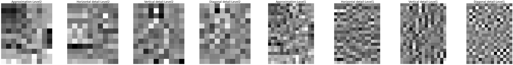
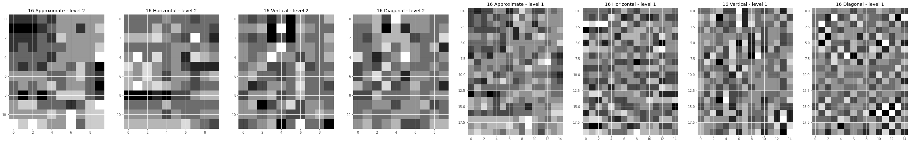
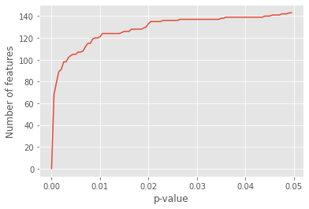

# A Novel Multiresolution-Statistical Texture Analysis Architecture: Radiomics-Aided Diagnosis of PDAC Based on Plain CT Images

This repo contains the implementation of the “A Novel Multiresolution-Statistical Texture Analysis Architecture: Radiomics-Aided Diagnosis of PDAC Based on Plain CT Images” paper published at IEEE transactions on Medical Imaging (January 2021).

## Introduction

Pancreatic ductal adenocarcinoma is a type of tumor, which has poor diagnosis. Early diagnosis of PDAC has great significance. The paper uses Plain CT images to diagnose PDAC. 

## Methodology followed

1. Multiresolution analysis decomposes an ROI into multiple low-/high-frequency sub-band components.2
    1. 2D wavelet transform was used
    
    
    
2. Random Partitioning
    
    The dataset (i.e., the ROIs) randomly divided into a training set and a test at a ratio of 7:3.
    
3. Analysis of coefficients characteristics
    1. Finding the average of maximums and minimums - ROIs are group by components are labels, and maximums and minimums of each group determined. 
    2. Restructure the interval based on maximum and minimum determined previously for each component separately.
4. Discretize ROIs
    1. Number of bins used is 8
    
    
    
5. Statistical Analysis and feature extraction, following statistical methods were used.
    1. Histogram (H) - mean, variance, skewness, kurtosis, entropy
    2. Co-efficient statistics (CS) - mean, standard deviation, energy
    3. Co-occurrence matrix (COM) - contrast, energy, homogeneity, correlation
    4. Run-length matrix (RLM) - All 11 features mentioned in the paper
6. Feature selection (based on training dataset)
    1. ILFS - infinite latent feature selection algorithm :  rank the features based on the training set and selected the first k features. (k<20)
7. Classification
    1. SVM (linear kernel) 
    2. Decision Tree, KNN and Poly SVM were also implemented
8. Significance Testing
    1. Mann-Whitney U test 

## Classification Results

Followings are the results achieved with SVM classifier, with wavelet transform as multi resolution analysis method (number of bins = 8, number of features = 20) for different statistical analysis methods.

Followings are the results achieved with different machine learning classifier, with wavelet transform as multi resolution analysis method (number of bins = 8, number of features = 20) when all the statistical analysis methods used to extract features.

For number of features = 32

## Significance Testing

Non-parametric significance test - Mann-Whitney U test was used. Here the median are compared instead of mean. Number of significance features for different p-values.

Two features with smallest p-value in one-tailed test from each statistical analysis method (except - ALL case) selected. Results of two tailed test (left and right tailed tests) were given below.

Interpret the above table :

1. Standard deviation of vertical wavelet component of level 2 is higher in Healthy Pancreas (HP) than PDAC.
2. Mean of vertical wavelet component of level 1 is significantly different for PDAC and HP.
3. Long Run Emphasis of approximation wavelet component of level 1 is significantly higher in PDAC than HP.

## Acknowledgement

I would like to express my special thanks of gratitude to Dr. Nuwan Dayananda and Dr. Ranga Rodrigo who gave me the golden opportunity to work on the implementation of a journal paper.

## Reference

Qiu, J.J., Yin, J., Qian, W., Liu, J.H., Huang, Z.X., Yu, H.P., Ji, L. and Zeng, X.X., 2020. “A Novel Multiresolution-Statistical Texture Analysis Architecture: Radiomics-Aided Diagnosis of PDAC Based on Plain CT Images”. *IEEE Transactions on Medical Imaging*, *40*(1), pp.12-25.
